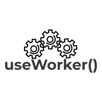

<h1 align="center">
  <br>
   
  <br>
</h1>

<h2 align="center">
  ⚛️ useWorker - Use web workers with react hooks
</h2>

<h3 align="center">
  
  
  
</h3>


---

## Features

- Run expensive function **without blocking UI** ([Show live gif](https://github.com/alewin/useWorker/issues/2))
- Supports **Promises** pattern instead of event-messages
- Size: `< 1KB`, with `zero` dependencies
- Clear **API** using hook

---

## [Install](https://www.npmjs.com/package/@koale/useworker)

```bash
npm i @koale/useworker
```

---

## Import

```jsx
import useWorker, { WORKER_STATUS } from "@koale/useworker";
```

---

## API

```javascript
const [workerFn, workerStatus, workerTerminate] = useWorker(fun);
```

| Value           | Type             | Description                                                |
| --------------- | ---------------- | ---------------------------------------------------------- |
| fn              | Function         | The `pure function` to run with web workers                |
| workerFn        | Promise Function | The `function` that allows you to run `fn` with web worker |
| workerStatus    | `@WORKER_STATUS` | The status of `workerFn` function                          |
| workerTerminate | Function         | The function that allow to kill the worker                 |

## `WORKER_STATUS`: Worker Status

```jsx
import { WORKER_STATUS } from "@koale/useworker";
```

| WORKER_STATUS | Type   | Description                                                      |
| ------------- | ------ | ---------------------------------------------------------------- |
| `PENDING`     | string | the web worker has been initialized, but has not yet been runned |
| `SUCCESS`     | string | the web worker, has been executed correctly                      |
| `RUNNING`     | string | the web worker, is running                                       |
| `ERROR`       | string | the web worker, ended with an error                              |

---

## Web Workers

Before you start using this [hook](https://www.npmjs.com/package/@koale/useworker), I suggest you to read the [Web Worker](https://developer.mozilla.org/en-US/docs/Web/API/Web_Workers_API/Using_web_workers) documentation.

> Remember that your web worker function `fn` must be a function **without** dependencies, which **does not** produce side-effects, access the DOM or use page's objects.

---

## Usage

```jsx
import React from "react";
import useWorker from "@koale/useworker";

const numbers = [...Array(5000000)].map(e => ~~(Math.random() * 1000000));
const sortNumbers = nums => nums.sort();

const Example = () => {
  const [sortWorker] = useWorker(sortNumbers);

  const runSort = async () => {
    const result = await sortWorker(numbers); // non-blocking UI
    console.log("End.");
  };

  return (
    <button type="button" onClick={runSort}>
      Run Sort
    </button>
  );
};

```

---

## Example

[](https://codesandbox.io/s/exciting-jackson-b5ljt?fontsize=14&hidenavigation=1&theme=dark)

More examples: https://github.com/alewin/useWorker/tree/develop/example

---

## Roadmap

- [x] Kill Web Worker
- [x] Reactive web worker status
- [ ] import and use external script inside `useWorker` function

---

## Contribute? Bug? New Feature?

The library is experimental so if you find a **bug** or would like to request a new **feature**, open an [issue](https://github.com/alewin/useWorker/issues/new)

---

## License

MIT © [alewin](https://github.com/alewin)
